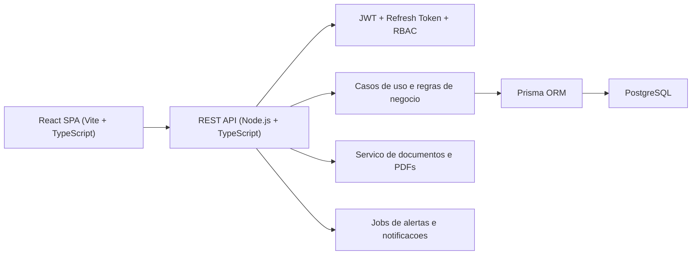

# FASE 1 - Arquitetura, Modelagem e Planejamento

## 1. Resumo do que sera feito

Esta fase estabelece a fundacao tecnica e funcional do produto antes do setup do frontend e do backend. O objetivo e definir:

- a arquitetura macro do SaaS imobiliario;
- a estrutura de pastas do monorepo;
- a modelagem inicial do banco com Prisma e PostgreSQL;
- o desenho de RBAC com perfis, permissoes e guardas;
- as rotas principais do sistema;
- os fluxos operacionais e regras de negocio que orientarao as proximas fases;
- os wireframes textuais das telas prioritarias.

O projeto foi desenhado para crescer de forma modular, com separacao clara entre interface, regras de negocio, camada de acesso a dados, autenticacao, auditoria, contratos e notificacoes.

## 2. Arquitetura proposta

### 2.1 Visao macro

O sistema sera estruturado como um monorepo com duas aplicacoes principais:

- `apps/web`: frontend React com Vite, TypeScript, React Router, TanStack Query, React Hook Form, Zod e Tailwind CSS.
- `apps/api`: backend Node.js com TypeScript, API REST, Prisma ORM e PostgreSQL.

Complementando as apps:

- `packages/ui`: biblioteca compartilhada de componentes visuais, tokens e primitives.
- `packages/shared`: tipos compartilhados, contratos de API, enums publicos e utilitarios.
- `docs`: documentacao arquitetural, fluxos, wireframes e decisoes do produto.

### 2.2 Fluxo tecnico principal



### 2.3 Principios arquiteturais

- **Separacao entre regra e interface**: formularios, tabelas e modais no frontend nao conhecem regras criticas; validacoes sensiveis permanecem no backend.
- **Modularidade por dominio**: cada modulo de negocio tera controller, service, schemas, repository, policy e testes proprios.
- **Escalabilidade operacional**: estrutura preparada para crescimento de times, modulos, permissoes e automacoes.
- **Seguranca por padrao**: JWT de curta duracao, refresh token persistido com hash, validacoes por permissao, auditoria e tratamento minimo de dados pessoais sob boas praticas de LGPD.
- **UX administrativa premium**: navegacao clara, respostas rapidas, estados vazios bem resolvidos, filtros eficientes, feedbacks consistentes e foco em produtividade.

### 2.4 Camadas do backend

Cada modulo do backend sera organizado com responsabilidades bem definidas:

- `controllers`: entrada HTTP, serializacao e codigos de resposta.
- `schemas`: validacao com Zod para payloads e query params.
- `services` ou `use-cases`: regras de negocio e orquestracao.
- `repositories`: acesso a dados encapsulado sobre Prisma.
- `policies`: verificacao de permissao por acao, perfil e contexto.
- `mappers`: adaptacao entre modelos do banco e contratos da API.

### 2.5 Camadas do frontend

O frontend sera estruturado para evitar dependencia acidental entre telas e componentes:

- `app`: bootstrap, providers globais, tema, query client e router.
- `layouts`: shell autenticado, sidebar, topbar e containers.
- `features`: modulos com formularios, tabelas, cards e regras de tela.
- `pages`: composicao das paginas e orquestracao visual.
- `services`: clientes HTTP, hooks de query e mutacoes.
- `shared`: utils, formatadores, hooks genericos, componentes base e tokens.

### 2.6 Fluxos centrais do negocio

#### Autenticacao e sessao

1. Usuario autentica com email e senha.
2. Backend valida hash da senha e status do usuario.
3. API emite `accessToken` curto e `refreshToken` persistido com hash.
4. Frontend protege rotas por autenticacao e permissoes.
5. Renovacao de sessao ocorre por refresh token revogavel.

#### Pipeline de locacao para contrato ativo

1. Lead de locacao entra no pipeline.
2. Equipe evolui o lead por etapas.
3. Visitas ficam vinculadas ao lead e ao imovel.
4. Ao chegar em documentacao e aprovacao, o sistema permite gerar contrato.
5. O contrato nasce em rascunho, com versoes e revisao obrigatoria.
6. Apos revisao e assinatura, o contrato muda para ativo.
7. Jobs geram alertas de vencimento e renovacao.

#### Controle de chaves

1. Cada imovel pode possuir uma ou mais chaves cadastradas.
2. Cada chave tem status corrente e historico de movimentacoes.
3. Retirada exige responsavel, horario e contexto.
4. O sistema impede nova retirada quando a chave estiver em posse de alguem, salvo permissao de override.
5. Alertas podem ser disparados quando a posse exceder o prazo esperado.

### 2.7 Decisoes importantes desta fase

- Monorepo com compartilhamento de componentes e tipos para acelerar consistencia.
- RBAC real baseado em `Role`, `Permission`, `UserRole` e `RolePermission`.
- Auditoria transversal para alteracoes sensiveis, login, contratos e chaves.
- Geracao de contrato com versao, snapshot dos dados e aviso juridico explicito.
- Preparacao para anexos e exportacao PDF sem acoplamento ao storage final.

## 3. Estrutura de pastas

Estrutura planejada do repositorio:

```text
/apps
  /api
    /prisma
      schema.prisma
      /migrations
      seed.ts
    /src
      /config
      /core
        auth.ts
        env.ts
        logger.ts
      /middlewares
      /modules
        /auth
        /users
        /roles
        /permissions
        /owners
        /tenants
        /properties
        /sale-leads
        /rent-leads
        /visits
        /keys
        /contracts
        /documents
        /notifications
        /dashboard
        /audit
      /shared
        /errors
        /http
        /utils
      /jobs
      main.ts
  /web
    /public
    /src
      /app
      /assets
      /components
        /feedback
        /form
        /layout
        /table
      /features
        /auth
        /dashboard
        /owners
        /tenants
        /properties
        /sale-pipeline
        /rent-pipeline
        /visits
        /keys
        /contracts
        /users
        /settings
      /hooks
      /layouts
      /lib
      /pages
      /routes
      /services
      /styles
      /types
      main.tsx
/packages
  /shared
    /src
      permissions.ts
      routes.ts
      enums.ts
      dto.ts
  /ui
    /src
      /components
      /tokens
      /utils
/docs
  fase-1-arquitetura.md
  fase-1-wireframes.md
/prisma.config.ts
```

### 3.1 Explicacao da estrutura

- `apps/api`: concentrara API, autenticacao, regras de negocio, Prisma, jobs e middlewares.
- `apps/web`: concentrara a experiencia administrativa, componentes de layout, paginas e features.
- `packages/shared`: mantera contratos reutilizaveis entre frontend e backend, reduzindo divergencia de enums e permissoes.
- `packages/ui`: armazenara primitives, componentes compartilhados e tokens visuais da interface.
- `docs`: vira a base viva do produto, com desenho funcional e decisao arquitetural.
- `prisma.config.ts`: centralizara a localizacao do schema e a configuracao moderna do datasource para Prisma.

## 4. Entidades e relacoes

O modelo inicial do banco foi materializado em [apps/api/prisma/schema.prisma](/D:/Imobiliaria/apps/api/prisma/schema.prisma).

### 4.1 Nucleo de acesso e seguranca

- `User`: usuarios do sistema, com status, hash de senha, ultimo login e relacoes com a operacao.
- `Role`: perfis reutilizaveis como `MASTER_ADMIN` e `USER_OPERACIONAL`.
- `Permission`: capacidade atomica, por exemplo `properties.read`, `contracts.generate`.
- `UserRole`: associacao entre usuario e papel.
- `RolePermission`: associacao entre papel e permissao.
- `RefreshToken`: tokens de renovacao persistidos com hash e revogacao.
- `PasswordResetToken`: suporte a recuperacao de senha com expiracao e uso unico.

### 4.2 Nucleo cadastral

- `Owner`: proprietario com dados pessoais, endereco, dados bancarios e historico.
- `Tenant`: locatario com dados pessoais, endereco, score cadastral e historico.
- `Property`: imovel com endereco, finalidade, valores, status comercial, caracteristicas e vinculo ao proprietario.
- `Document`: anexos e arquivos ligados a imovel, proprietario, locatario, lead e contrato.

### 4.3 Nucleo comercial e operacional

- `SaleLead`: lead de venda com etapa do pipeline, responsavel, interesse e historico.
- `RentLead`: lead de locacao com etapa do pipeline, possivel locatario associado e dados da negociacao.
- `Visit`: visita sempre vinculada a um imovel e a um lead de venda ou locacao.
- `PropertyKey`: identificacao da chave fisica por imovel, com status atual e posse corrente.
- `KeyControl`: historico de retirada, devolucao, bloqueio, manutencao e override da chave.

### 4.4 Nucleo contratual

- `Contract`: contrato de locacao com origem, valor, prazo, garantia, reajuste, clausulas adicionais e status.
- `ContractVersion`: versoes geradas do contrato, com snapshot dos dados, HTML renderizado, PDF e revisao.

### 4.5 Nucleo de observabilidade

- `AuditLog`: trilha de alteracoes sensiveis e acoes relevantes.
- `Notification`: alertas operacionais, lembretes e avisos de risco vinculados a usuarios.

### 4.6 Relacoes principais

- um `Owner` possui varios `Property`;
- um `Property` pode ter varios `SaleLead`, `RentLead`, `Visit`, `PropertyKey` e `Contract`;
- um `Tenant` pode ter varios `Contract` e pode estar associado a `RentLead`;
- um `RentLead` pode originar contratos;
- um `Contract` possui varias `ContractVersion`;
- um `PropertyKey` possui varios registros em `KeyControl`;
- um `User` participa como responsavel por leads, corretor de visitas, revisor de contratos e agente de auditoria.

### 4.7 Regras de integridade que ficarao na camada de servico

Nem todas as regras cabem apenas no schema. Estas regras deverao ser aplicadas na camada de negocio:

- visita deve ter exatamente um vinculo comercial: `saleLeadId` ou `rentLeadId`;
- imovel alugado nao pode permanecer disponivel para locacao;
- imovel vendido nao pode permanecer disponivel no funil de venda;
- nao permitir checkout de chave quando o status atual for `CHECKED_OUT`, salvo permissao de override;
- contrato ativo deve nascer de `RentLead` ou de acao autorizada manual;
- exclusoes sensiveis deverao ser logadas e, preferencialmente, tratadas como inativacao ou arquivamento.

## 5. Rotas da aplicacao

### 5.1 Rotas frontend

- `/login`
- `/recuperar-senha`
- `/dashboard`
- `/vendas`
- `/vendas/:leadId`
- `/locacoes`
- `/locacoes/:leadId`
- `/agenda/visitas`
- `/chaves`
- `/contratos`
- `/contratos/:contractId`
- `/contratos/gerador`
- `/proprietarios`
- `/proprietarios/:ownerId`
- `/locatarios`
- `/locatarios/:tenantId`
- `/imoveis`
- `/imoveis/:propertyId`
- `/usuarios`
- `/configuracoes`
- `/403`

### 5.2 Rotas backend REST por modulo

#### Auth

- `POST /auth/login`
- `POST /auth/refresh`
- `POST /auth/logout`
- `POST /auth/forgot-password`
- `POST /auth/reset-password`
- `GET /auth/me`

#### Usuarios, papeis e permissoes

- `GET /users`
- `POST /users`
- `PATCH /users/:id`
- `PATCH /users/:id/status`
- `POST /users/:id/reset-password`
- `GET /roles`
- `GET /permissions`

#### Cadastros principais

- `GET|POST /owners`
- `GET|PATCH /owners/:id`
- `GET|POST /tenants`
- `GET|PATCH /tenants/:id`
- `GET|POST /properties`
- `GET|PATCH /properties/:id`
- `GET /properties/:id/detail`

#### Comercial

- `GET|POST /sale-leads`
- `GET|PATCH /sale-leads/:id`
- `PATCH /sale-leads/:id/stage`
- `GET|POST /rent-leads`
- `GET|PATCH /rent-leads/:id`
- `PATCH /rent-leads/:id/stage`

#### Operacao

- `GET|POST /visits`
- `GET|PATCH /visits/:id`
- `GET|POST /property-keys`
- `GET /property-keys/:id/history`
- `POST /property-keys/:id/checkout`
- `POST /property-keys/:id/checkin`
- `POST /property-keys/:id/override`

#### Contratos

- `GET|POST /contracts`
- `GET /contracts/:id`
- `PATCH /contracts/:id`
- `POST /contracts/:id/generate-version`
- `POST /contracts/:id/review`
- `POST /contracts/:id/export-pdf`
- `POST /contracts/:id/activate`
- `POST /contracts/:id/terminate`

#### Auditoria, dashboard e notificacoes

- `GET /dashboard/summary`
- `GET /reports/contracts`
- `GET /reports/pipeline`
- `GET /audit-logs`
- `GET /notifications`
- `PATCH /notifications/:id/read`

## 6. Regras de permissao

### 6.1 Estrategia de RBAC

O sistema usara RBAC real em tres niveis:

1. **Autenticacao**: usuario autenticado e token valido.
2. **Papel**: associacao com `Role` para agrupamento de acesso.
3. **Permissao atomica**: verificacao por acao e recurso, permitindo evolucao granular.

### 6.2 Perfis iniciais

#### `MASTER_ADMIN`

- acesso total a dashboards, relatorios, cadastros e configuracoes;
- pode gerir usuarios, papeis e permissoes;
- pode visualizar logs e auditoria;
- pode gerar, revisar, exportar e ativar contratos;
- pode realizar override de regras sensiveis, sempre com auditoria.

#### `USER_OPERACIONAL`

- acesso ao operacional diario;
- pode cadastrar e atualizar visitas;
- pode movimentar funis conforme permissao definida;
- pode cadastrar clientes, imoveis, proprietarios e locatarios conforme escopo liberado;
- pode registrar retirada e devolucao de chaves;
- nao pode ver relatorios estrategicos;
- nao pode editar permissoes ou configuracoes globais;
- nao pode excluir registros sensiveis sem privilegio explicito;
- nao pode fazer override de inconsistencias criticas sem permissao adicional.

### 6.3 Matriz inicial de permissoes

| Recurso | Permissao | MASTER_ADMIN | USER_OPERACIONAL |
| --- | --- | --- | --- |
| Dashboard | `dashboard.read` | Sim | Sim |
| Relatorios | `reports.read` | Sim | Nao |
| Usuarios | `users.manage` | Sim | Nao |
| Papeis e permissoes | `access.manage` | Sim | Nao |
| Configuracoes | `settings.manage` | Sim | Nao |
| Proprietarios | `owners.read/write` | Sim | Sim |
| Locatarios | `tenants.read/write` | Sim | Sim |
| Imoveis | `properties.read/write` | Sim | Sim |
| Pipeline de vendas | `saleLeads.read/write` | Sim | Sim |
| Pipeline de locacao | `rentLeads.read/write` | Sim | Sim |
| Visitas | `visits.read/write` | Sim | Sim |
| Chaves | `keys.read/write` | Sim | Sim |
| Override de chaves | `keys.override` | Sim | Nao |
| Contratos | `contracts.read` | Sim | Conforme escopo |
| Gerar contrato | `contracts.generate` | Sim | Nao |
| Revisar contrato | `contracts.review` | Sim | Nao |
| Exportar PDF | `contracts.export` | Sim | Nao |
| Auditoria | `audit.read` | Sim | Nao |

### 6.4 Aplicacao no backend

- middleware de autenticacao para leitura e validacao do JWT;
- middleware de autorizacao recebendo a permissao requerida por rota;
- policies por dominio para validar contexto, por exemplo:
  - impedir override de chave sem permissao;
  - impedir ativacao manual de contrato sem papel autorizado;
  - impedir alteracao de usuario por quem nao possua `users.manage`.

### 6.5 Aplicacao no frontend

- `ProtectedRoute` para usuario autenticado;
- `PermissionGuard` para esconder ou bloquear telas, tabs, botoes e acoes;
- menu lateral montado com base em permissoes;
- componentes de acao sensivel mostrando tooltip de indisponibilidade quando necessario.

## 7. Plano de implementacao por etapas

### Fase 1 - Arquitetura, dados e desenho funcional

- definir arquitetura, monorepo e modulos;
- modelar schema inicial do banco;
- mapear rotas, permissoes e wireframes;
- fechar contratos tecnicos entre frontend e backend.

### Fase 2 - Fundacao tecnica

- inicializar monorepo com frontend e backend;
- configurar Tailwind, React Router, TanStack Query, React Hook Form e Zod;
- configurar API, Prisma, PostgreSQL, autenticacao JWT e refresh token;
- implementar layout autenticado, sidebar, topbar, tema global, toasts e rotas protegidas.

### Fase 3 - Cadastros centrais

- implementar modulos de imoveis, proprietarios, locatarios e usuarios;
- criar formularios, listagens, filtros, drawers, detalhes e validacoes;
- adicionar auditoria para alteracoes sensiveis;
- padronizar componentes compartilhados.

### Fase 4 - Operacao comercial e presencial

- construir pipeline de vendas;
- construir pipeline de locacao;
- implementar agenda de visitas com vinculacao obrigatoria a imovel e lead;
- implementar controle de chaves com bloqueios de inconsistencias e historico.

### Fase 5 - Contratos e documentos

- construir modulo de contratos ativos;
- implementar gerador de contrato com template parametrizavel;
- gerar e versionar minutas;
- exportar PDF;
- exigir revisao responsavel antes da finalizacao;
- sinalizar validacao juridica obrigatoria.

### Fase 6 - Dashboard, relatorios e polimento

- construir dashboard consolidado;
- implementar alertas, notificacoes e jobs de vencimento;
- criar relatorios principais;
- refinar UX, skeletons, estados vazios, erros, performance e responsividade.

## 8. Codigo completo da etapa atual

Os artefatos completos desta fase sao:

- documentacao arquitetural: [docs/fase-1-arquitetura.md](/D:/Imobiliaria/docs/fase-1-arquitetura.md)
- wireframes textuais: [docs/fase-1-wireframes.md](/D:/Imobiliaria/docs/fase-1-wireframes.md)
- modelagem inicial do banco: [apps/api/prisma/schema.prisma](/D:/Imobiliaria/apps/api/prisma/schema.prisma)
- configuracao moderna do Prisma: [prisma.config.ts](/D:/Imobiliaria/prisma.config.ts)

## 9. Proxima etapa sugerida

Seguir para a **FASE 2**, iniciando o monorepo e entregando:

- setup do `apps/web` com Vite, React, TypeScript e Tailwind;
- setup do `apps/api` com Node.js, TypeScript, Prisma e estrutura modular;
- configuracao do PostgreSQL;
- autenticacao JWT com refresh token;
- layout base administrativo com rotas protegidas e tema visual global.
